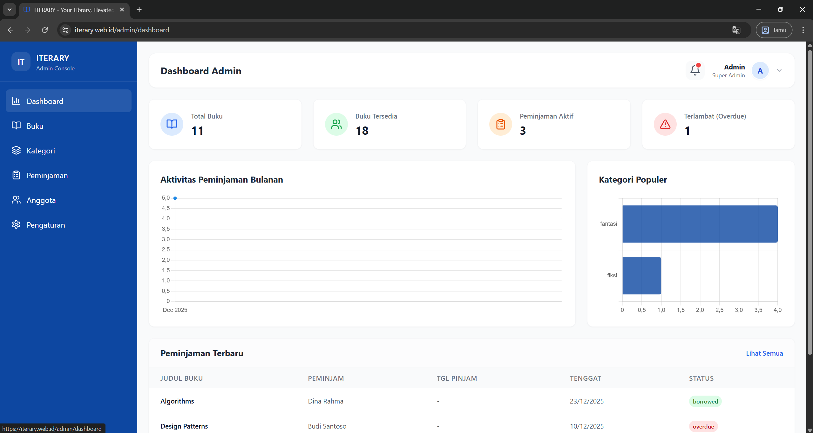

# ITERARY
## ITERA Library And Reading facilitY




> Sistem manajemen perpustakaan digital berbasis cloud untuk Institut Teknologi Sumatera

## 🔗 Link Penting
- 🌐 **Website:** [https://iterary.web.id](https://iterary.web.id)  
- 📦 **Repository:** [https://github.com/adityasuhendar/ITERARY.git](https://github.com/adityasuhendar/ITERARY.git)  
- 🎬 **Video Demo:** [https://s.itera.id/Video-ITERARY](https://s.itera.id/Video-ITERARY)  
- 📄 **Laporan:** [https://s.itera.id/Laporan-ITERARY](https://s.itera.id/Laporan-ITERARY)

---

## 📖 Tentang ITERARY

ITERARY (ITERA Library And Reading facilitY) adalah sistem manajemen perpustakaan digital berbasis cloud yang dikembangkan untuk mengelola katalog buku, peminjaman, dan administrasi perpustakaan di kampus Institut Teknologi Sumatera.

### ✨ Fitur Utama

- 🔍 **Pencarian & Peminjaman Digital** - Sistem pencarian cepat dengan filter kategori dan status ketersediaan
- 📊 **Dashboard Real-time** - Monitoring aktivitas peminjaman dan statistik dengan visualisasi grafik
- 📱 **Progressive Web App (PWA)** - Dapat diinstall di smartphone dan desktop seperti aplikasi native
- ☁️ **Cloud-Based** - Beroperasi 24/7 dengan performa optimal berkat Google Cloud Platform
- 🚀 **Auto-Scaling** - Scalable dan reliable dengan teknologi containerization
- ⚡ **Redis Caching** - Performa optimal dengan caching layer

---

## 🎯 Tujuan Pengembangan

### 1. Mempermudah Aksesibilitas Informasi dan Peminjaman Buku
Memberikan kemudahan bagi mahasiswa dan dosen untuk mencari, mengakses informasi, serta melakukan peminjaman buku secara fleksibel kapan saja dan di mana saja melalui sistem digital berbasis PWA.

### 2. Digitalisasi Pengelolaan Katalog dan Peminjaman
Mentransformasi sistem pencatatan manual menjadi database digital terpusat dengan fitur lengkap (cover buku, kategori, status ketersediaan, tracking peminjaman) untuk menjamin akurasi, kerapian, dan keamanan data.

### 3. Efisiensi Administrasi dan Monitoring Perpustakaan
Meningkatkan efisiensi operasional dengan dashboard admin terpusat yang dilengkapi statistik real-time, visualisasi grafik peminjaman, dan manajemen koleksi buku lengkap.

### 4. Modernisasi Fasilitas Kampus dengan Cloud Technology
Mendukung digitalisasi lingkungan akademik ITERA dengan menghadirkan fasilitas perpustakaan modern berbasis cloud computing yang scalable, reliable, dan terintegrasi dengan teknologi terkini.

---

## 👥 Tim Pengembang

**Kelompok 1:**
1. Edwin Darren Hasannudin (122140111)
2. Michael Caren Sihombing (122140066)
3. Marchel Karuna Kwee (122140065)
4. Muhammad Fauzan As Shabierin (122140074)
5. Aditya Wahyu Suhendar (122140235)
6. Dina Rahma Dita (122140184)

---

## 🏗️ Arsitektur Sistem

### Three-Tier Architecture

```
┌─────────────────────────────────────────────────────────┐
│                   PRESENTATION LAYER                     │
│  ┌──────────────────────────────────────────────────┐   │
│  │  Progressive Web App (PWA)                       │   │
│  │  - React.js Frontend                             │   │
│  │  - Responsive Design                             │   │
│  │  - Installable App                               │   │
│  └──────────────────────────────────────────────────┘   │
└────────────────────────┬────────────────────────────────┘
                         │
┌────────────────────────┴────────────────────────────────┐
│                   APPLICATION LAYER                      │
│  ┌──────────────────────────────────────────────────┐   │
│  │  Cloud Run (Backend API)                         │   │
│  │  - Node.js + Express.js                          │   │
│  │  - RESTful API                                   │   │
│  │  - JWT Authentication                            │   │
│  │  - Auto-scaling                                  │   │
│  └──────────────────────────────────────────────────┘   │
└────────────────────────┬────────────────────────────────┘
                         │
┌────────────────────────┴────────────────────────────────┐
│                     DATA LAYER                           │
│  ┌─────────────────────┐  ┌─────────────────────────┐   │
│  │  Cloud SQL (MySQL)  │  │  Redis (Memorystore)    │   │
│  │  - Main Database    │  │  - Caching Layer        │   │
│  │  - Data Persistence │  │  - Performance Boost    │   │
│  └─────────────────────┘  └─────────────────────────┘   │
│  ┌─────────────────────────────────────────────────┐    │
│  │  Cloud Storage                                   │    │
│  │  - Book Cover Images                             │    │
│  │  - Static Assets                                 │    │
│  └─────────────────────────────────────────────────┘    │
└──────────────────────────────────────────────────────────┘
```

---

## 🛠️ Tech Stack

### Frontend
- **Framework:** React.js
- **UI Library:** Tailwind CSS / Material-UI
- **State Management:** Redux / Context API
- **PWA:** Service Workers, Web App Manifest
- **Build Tool:** Vite / Webpack
- **Deployment:** Cloud Run (Nginx)

### Backend
- **Runtime:** Node.js 18
- **Framework:** Express.js
- **Authentication:** JWT (JSON Web Tokens)
- **File Upload:** Multer
- **API Documentation:** Swagger / OpenAPI
- **Deployment:** Cloud Run (Containerized)

### Database & Storage
- **Primary Database:** Cloud SQL (MySQL)
- **Caching:** Cloud Memorystore for Redis
- **Object Storage:** Cloud Storage
- **Image CDN:** Cloud CDN

### Infrastructure (Google Cloud Platform)
- **Container Registry:** Artifact Registry
- **Compute:** Cloud Run (Serverless)
- **Networking:** VPC Connector
- **Database:** Cloud SQL
- **Caching:** Cloud Memorystore (Redis)
- **Storage:** Cloud Storage
- **CI/CD:** Cloud Build
- **Monitoring:** Cloud Monitoring & Logging

### DevOps
- **Containerization:** Docker
- **CI/CD:** Cloud Build (Automated)
- **Version Control:** Git & GitHub
- **Infrastructure as Code:** gcloud CLI

---

## 🚀 CI/CD (Cloud Build)

Build dan deploy otomatis saat push ke branch `main`.

**Pipeline overview:**
- Build Docker image untuk backend dan frontend
- Push ke Artifact Registry: `asia-southeast2-docker.pkg.dev/iterary-479520/iterary-repo/`
- Deploy ke Cloud Run (`iterary-api`, `iterary-frontend`)

**Trigger setup (Console):**
- Cloud Build → Triggers → Create Trigger
- Repository: `adityasuhendar/ITERARY`
- Event: `Push to a branch`, Branch regex: `^main$`
- Configuration: `Autodetected` atau `Cloud Build configuration file`
- Jika pilih configuration file: path `/cloudbuild.yaml`
- Service account: pilih user-managed SA dengan roles minimal: Cloud Run Admin, Artifact Registry Writer, Secret Manager Access (opsional)

**Trigger setup (CLI):**
```bash
gcloud builds triggers create github \
  --name="iterary-main" \
  --repo-owner="adityasuhendar" \
  --repo-name="ITERARY" \
  --branch-pattern="^main$" \
  --build-config="cloudbuild.yaml" \
  --project="iterary-479520"
```

**Backend deploy env vars (contoh):**
- `DB_HOST=/cloudsql/iterary-479520:asia-southeast2:iterary-db-ad5f6e51` (unix socket) atau gunakan `DB_SOCKET_PATH`
- `DB_PORT=3306`, `DB_USER=adminsql`, `DB_PASSWORD` (gunakan Secret Manager untuk production)
- `DB_NAME=iterary`
- `REDIS_ENABLED=true/false`, `REDIS_HOST`, `REDIS_PORT`
- `JWT_SECRET`, `JWT_EXPIRES_IN=7d`
- `CORS_ORIGIN=https://iterary-frontend-...asia-southeast2.run.app`
- Tambahan Cloud Run flags: `--add-cloudsql-instances`, `--vpc-connector`, `--allow-unauthenticated`

**Path filters (opsional, lebih efisien):**
- Buat 2 trigger terpisah:
  - Backend trigger: include files `backend/**`
  - Frontend trigger: include files `frontend/**`
- Hanya service yang berubah yang dibuild dan dideploy

**Troubleshooting cepat:**
- Artifact Registry: pastikan SA punya role `roles/artifactregistry.writer`
- Cloud Run cannot connect DB: cek `--add-cloudsql-instances` dan VPC connector
- Frontend API 404: pastikan `VITE_API_URL` mengarah ke URL Cloud Run backend
- Build log: pantau di Cloud Build history, buka step yang gagal

---

---

## 📊 Database Schema

### Main Tables

#### **users**
- `id` (PK)
- `email`
- `password` (hashed)
- `name`
- `role` (admin/member)
- `nim` (for students)
- `created_at`
- `updated_at`

#### **books**
- `id` (PK)
- `title`
- `author`
- `isbn`
- `category`
- `publisher`
- `publication_year`
- `stock`
- `available_stock`
- `cover_image_url`
- `description`
- `created_at`
- `updated_at`

#### **borrowings**
- `id` (PK)
- `user_id` (FK)
- `book_id` (FK)
- `borrow_date`
- `due_date`
- `return_date`
- `status` (borrowed/returned/overdue)
- `created_at`
- `updated_at`

#### **settings**
- `id` (PK)
- `key`
- `value`
- `updated_at`

---

## 👤 Peran Pengguna

### Mahasiswa (Member)
**Akses terbatas untuk manajemen pribadi:**
- ✅ Mencari dan melihat katalog buku
- ✅ Melihat detail buku (cover, deskripsi, ketersediaan)
- ✅ Melakukan peminjaman buku (7-30 hari)
- ✅ Melihat riwayat peminjaman pribadi
- ✅ Melihat status peminjaman aktif
- ✅ Notifikasi jatuh tempo

### Pustakawan (Admin)
**Akses penuh untuk manajemen operasional:**
- ✅ Manajemen katalog buku (CRUD)
- ✅ Upload cover buku
- ✅ Manajemen kategori
- ✅ Monitoring peminjaman real-time
- ✅ Manajemen data anggota
- ✅ Dashboard statistik dengan visualisasi grafik
- ✅ Laporan dan analytics
- ✅ Pengaturan sistem (logo & profil perpustakaan)

---

## 🚀 Quick Start

### Prerequisites
- Node.js 18+
- Docker & Docker Compose
- Google Cloud SDK (gcloud)
- Git

### Local Development

#### 1. Clone Repository
```bash
git clone https://github.com/adityasuhendar/ITERARY.git
cd ITERARY
```

#### 2. Setup Backend
```bash
cd backend
npm install

# Create .env file
cat > .env << EOF
DB_HOST=localhost
DB_PORT=3306
DB_USER=root
DB_PASSWORD=your_password
DB_NAME=iterary
REDIS_ENABLED=false
JWT_SECRET=your-secret-key
JWT_EXPIRES_IN=7d
CORS_ORIGIN=http://localhost:3000
NODE_ENV=development
EOF

# Run migrations
npm run migrate

# Start development server
npm run dev
```

#### 3. Setup Frontend
```bash
cd ../frontend
npm install

# Create .env file
cat > .env << EOF
VITE_API_URL=http://localhost:8080
EOF

# Start development server
npm run dev
```

#### 4. Access Application
- Frontend: http://localhost:3000
- Backend API: http://localhost:8080
- API Docs: http://localhost:8080/api-docs

---

## 🐳 Docker Deployment

### Build Docker Images

#### Backend
```bash
cd backend
docker build -t iterary-backend:latest .
```

#### Frontend
```bash
cd frontend
docker build -t iterary-frontend:latest .
```

### Run with Docker Compose
```bash
docker-compose up -d
```

---

## ☁️ Cloud Deployment (Google Cloud Platform)

### Automated CI/CD with Cloud Build

Every push to `main` branch triggers automatic deployment:

1. ✅ Build Backend & Frontend Docker images
2. ✅ Push images to Artifact Registry
3. ✅ Deploy Backend to Cloud Run
4. ✅ Deploy Frontend to Cloud Run

### Manual Deployment

#### 1. Configure gcloud
```bash
gcloud auth login
gcloud config set project iterary-479520
gcloud auth configure-docker asia-southeast2-docker.pkg.dev
```

#### 2. Deploy Backend
```bash
cd backend

# Build & Push
docker build -t asia-southeast2-docker.pkg.dev/iterary-479520/iterary-repo/iterary-backend:latest .
docker push asia-southeast2-docker.pkg.dev/iterary-479520/iterary-repo/iterary-backend:latest

# Deploy to Cloud Run
gcloud run deploy iterary-api \
  --image asia-southeast2-docker.pkg.dev/iterary-479520/iterary-repo/iterary-backend:latest \
  --region asia-southeast2 \
  --platform managed \
  --allow-unauthenticated \
  --add-cloudsql-instances iterary-479520:asia-southeast2:iterary-db-ad5f6e51 \
  --vpc-connector iterary-vpc-connector \
  --set-env-vars "DB_HOST=localhost,DB_PORT=3306,DB_USER=adminsql,DB_PASSWORD=password,DB_NAME=iterary,DB_SOCKET_PATH=/cloudsql/iterary-479520:asia-southeast2:iterary-db-ad5f6e51,REDIS_ENABLED=false,JWT_SECRET=your-secret-key,JWT_EXPIRES_IN=7d,NODE_ENV=production"
```

#### 3. Deploy Frontend
```bash
cd frontend

# Build & Push
docker build -t asia-southeast2-docker.pkg.dev/iterary-479520/iterary-repo/iterary-frontend:latest .
docker push asia-southeast2-docker.pkg.dev/iterary-479520/iterary-repo/iterary-frontend:latest

# Deploy to Cloud Run
gcloud run deploy iterary-frontend \
  --image asia-southeast2-docker.pkg.dev/iterary-479520/iterary-repo/iterary-frontend:latest \
  --region asia-southeast2 \
  --platform managed \
  --allow-unauthenticated
```

For detailed deployment guide, see [DEPLOYMENT.md](DEPLOYMENT.md)

---

## 📡 API Documentation

### Authentication Endpoints

#### Register
```http
POST /api/auth/register
Content-Type: application/json

{
  "email": "student@itera.ac.id",
  "password": "password123",
  "name": "John Doe",
  "nim": "122140001",
  "role": "member"
}
```

#### Login
```http
POST /api/auth/login
Content-Type: application/json

{
  "email": "student@itera.ac.id",
  "password": "password123"
}
```

### Books Endpoints

#### Get All Books
```http
GET /api/books?category=fiction&search=harry&page=1&limit=10
Authorization: Bearer {token}
```

#### Get Book by ID
```http
GET /api/books/:id
Authorization: Bearer {token}
```

#### Create Book (Admin only)
```http
POST /api/books
Authorization: Bearer {token}
Content-Type: multipart/form-data

{
  "title": "Book Title",
  "author": "Author Name",
  "isbn": "978-1234567890",
  "category": "Fiction",
  "publisher": "Publisher Name",
  "publication_year": 2024,
  "stock": 5,
  "description": "Book description",
  "cover": <file>
}
```

### Borrowing Endpoints

#### Create Borrowing
```http
POST /api/borrowings
Authorization: Bearer {token}
Content-Type: application/json

{
  "book_id": 1,
  "duration_days": 14
}
```

#### Get User Borrowings
```http
GET /api/borrowings/user
Authorization: Bearer {token}
```

#### Return Book
```http
PUT /api/borrowings/:id/return
Authorization: Bearer {token}
```

### Admin Endpoints

#### Dashboard Statistics
```http
GET /api/admin/statistics
Authorization: Bearer {token}
```

#### All Borrowings (Admin)
```http
GET /api/admin/borrowings?status=borrowed&page=1&limit=20
Authorization: Bearer {token}
```

For complete API documentation, visit: `/api-docs` (Swagger UI)

---

## 💰 Cost Analysis

### Monthly Infrastructure Cost (IDR)

| No | Component | Estimated Cost (IDR) |
|----|-----------|---------------------|
| 1 | Cloud SQL (Database) | Rp 284,373 |
| 2 | Cloud Memorystore (Redis) | Rp 474,793 |
| 3 | Serverless VPC Connector | Rp 31,038 |
| 4 | Cloud Run | Rp 922 |
| 5 | Artifact Registry | Rp 0 |
| 6 | Cloud Storage | Rp 0 |
| 7 | Networking | Rp 43,370 |
| 8 | Compute Engine | Rp 194,548 |
| 9 | Hosting | Rp 7,000 |
| **Total** | | **Rp 1,036,044 / month** |

> Catatan: Estimasi biaya dapat bervariasi berdasarkan penggunaan aktual

---

## ⚡ Performance Testing

### Load Testing Results
- **Concurrent Users:** 100
- **Response Time (avg):** < 200ms
- **Throughput:** 500 requests/second
- **Error Rate:** < 0.1%

### Responsive Design Testing
✅ **Desktop:** 1920x1080, 1366x768  
✅ **Tablet:** iPad Pro, iPad Air  
✅ **Mobile:** iPhone 14, Samsung Galaxy S23  
✅ **PWA Installation:** Works on all platforms

---

## 🔒 Security Features

- 🔐 JWT Authentication & Authorization
- 🛡️ Password Hashing (bcrypt)
- 🔒 HTTPS/SSL Encryption
- 🚫 CORS Protection
- 🛡️ SQL Injection Prevention
- 🔐 XSS Protection
- 🚨 Rate Limiting
- 📝 Audit Logging

---

## 📱 Progressive Web App (PWA) Features

- ✅ **Installable** - Can be installed like native apps
- ✅ **Offline Capable** - Works without internet (cached data)
- ✅ **Fast Loading** - Service Worker caching
- ✅ **Push Notifications** - Due date reminders
- ✅ **Responsive** - Works on all screen sizes
- ✅ **App-like Experience** - Fullscreen mode

---

## 🧪 Testing

### Run Tests
```bash
# Backend tests
cd backend
npm test

# Frontend tests
cd frontend
npm test

# E2E tests
npm run test:e2e
```

---

## 📈 Monitoring & Logging

### Cloud Monitoring
```bash
# View logs
gcloud logging read "resource.type=cloud_run_revision" --limit=50

# View metrics
gcloud monitoring dashboards list
```

### Application Monitoring
- **Uptime Monitoring:** Cloud Monitoring
- **Error Tracking:** Cloud Error Reporting
- **Performance:** Cloud Trace
- **Logs:** Cloud Logging

---

## 🤝 Contributing

Contributions are welcome! Please follow these steps:

1. Fork the repository
2. Create your feature branch (`git checkout -b feature/AmazingFeature`)
3. Commit your changes (`git commit -m 'Add some AmazingFeature'`)
4. Push to the branch (`git push origin feature/AmazingFeature`)
5. Open a Pull Request

---

## 📝 License

This project is licensed under the MIT License - see the [LICENSE](LICENSE) file for details.

---

## 📞 Contact & Support

**Project Maintainer:** Aditya Wahyu Suhendar

**Issues:** [GitHub Issues](https://github.com/adityasuhendar/ITERARY/issues)

**Website:** [https://iterary.web.id/](https://iterary.web.id/)

---

## 🙏 Acknowledgments

- Institut Teknologi Sumatera
- Google Cloud Platform
- Open Source Community
- All contributors and team members

---

<div align="center">

**Made with ❤️ by Kelompok 1**

[Website](https://iterary.web.id/) • [Documentation](https://github.com/adityasuhendar/ITERARY) • [Report Bug](https://github.com/adityasuhendar/ITERARY/issues)

</div>